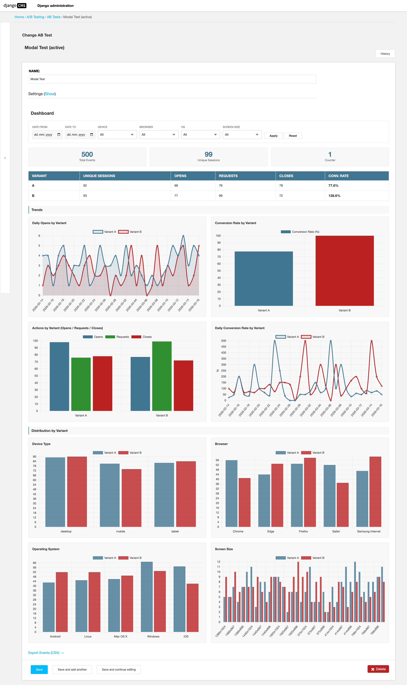
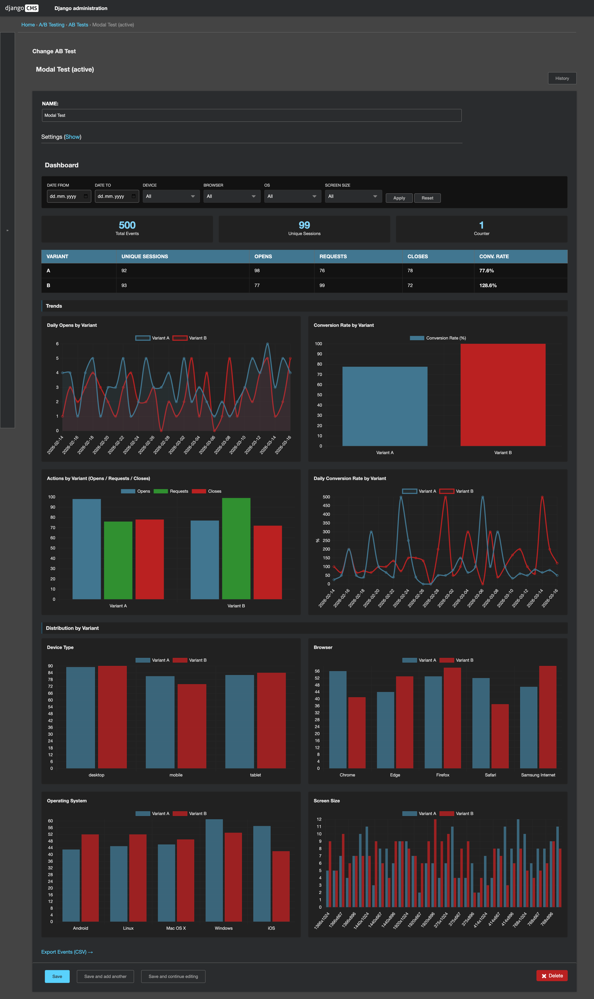

# djangocms-ab-testing

[](https://pypi.org/project/djangocms-ab-testing/)
[](https://pypi.org/project/djangocms-ab-testing/)
[](https://pypi.org/project/djangocms-ab-testing/)
[](https://opensource.org/licenses/MIT)

A full-featured **A/B testing** (split testing) plugin for **django CMS**. Run conversion optimization experiments directly in the CMS page editor with round-robin variant assignment, cookie-based persistence, client-side event tracking, and a built-in admin dashboard with Chart.js visualizations.

## Features

- **CMS plugin-based setup** - Add A/B test containers and variants directly in the django CMS page editor
- **Round-robin assignment** - Fair variant distribution using an atomic database counter
- **Cookie persistence** - Visitors see the same variant for 30 days (`ab_variant_<slug>`)
- **Event tracking API** - POST events to `/api/ab-event/` with CSRF protection
- **Auto "view" tracking** - Fires automatically when a variant is rendered
- **Bootstrap modal tracking** - Tracks `shown.bs.modal`, `hidden.bs.modal`, and CTA button clicks
- **Configurable actions** - Define custom tracking events via `AB_TESTING_VALID_ACTIONS` setting
- **Admin dashboard** - Chart.js-powered visualizations with summary cards, per-variant stats, daily trends, and conversion rate charts
- **Distribution breakdowns** - Analyze results by device type, browser, OS, and screen size
- **Filtering** - Filter dashboard data by date range and device properties
- **CSV export** - Export event data via django-import-export
- **Cache control** - Pages with A/B tests automatically get `Cache-Control: private, no-store`

## Screenshots

### Light theme


### Dark theme


## Installation

```sh
pip install djangocms-ab-testing
```

Add to `INSTALLED_APPS`:

```python
INSTALLED_APPS = [
    # ...
    "djangocms_ab_testing",
]
```

Add the middleware (after `SessionMiddleware`):

```python
MIDDLEWARE = [
    # ...
    "django.contrib.sessions.middleware.SessionMiddleware",
    "djangocms_ab_testing.middleware.ABCookieMiddleware",
    # ...
]
```

Add the URL config:

```python
from django.urls import include, path

urlpatterns = [
    # ...
    path("api/", include("djangocms_ab_testing.urls")),
]
```

Run migrations:

```sh
python manage.py migrate djangocms_ab_testing
```

## Usage

### 1. Create an AB Test

Go to **Django Admin > AB Tests** and create a test with a name and slug.

### 2. Add CMS Plugins

In the django CMS page editor:

1. Add an **A/B Test Container** plugin and link it to your test
2. Inside the container, add **A/B Test Variant** plugins (e.g. variant key `A`, `B`)
3. Add your content inside each variant

### 3. Track Events

Include the tracking script in your template:

```html
<script src=""></script>
```

The script auto-initializes, fires a `view` event when the variant is rendered, and tracks Bootstrap modal events (`shown.bs.modal`, `hidden.bs.modal`). Add the `ab-request-btn` class to CTA buttons inside modals to track conversion clicks.

For custom tracking, call `window.initABTracking()` after dynamic content loads.

### 4. View Results

Open any AB Test in the admin to see the dashboard with:

- Summary cards (total events, unique sessions, counter)
- Per-variant stats table (views, opens, requests, closes, conversion rate)
- Daily trends and conversion rate charts
- Distribution breakdowns by device, browser, OS, screen size
- Filterable by date range and device properties
- CSV export via django-import-export

## Configuration

### Custom Tracking Actions

By default, the following actions are tracked: `view`, `opened`, `closed`, `requested`.

To define custom actions, add `AB_TESTING_VALID_ACTIONS` to your Django settings:

```python
AB_TESTING_VALID_ACTIONS = {"view", "opened", "closed", "requested", "submitted", "purchased"}
```

The event tracking API will only accept actions in this set. The admin dashboard and seed command will also use these actions automatically.

## How It Works

- **Variant assignment**: Round-robin via atomic database counter
- **Persistence**: 30-day cookie per test (`ab_variant_<slug>`)
- **Cache**: Pages with A/B tests get `Cache-Control: private, no-store`
- **Events**: Tracked via POST to `/api/ab-event/` with CSRF protection

## Management Commands

```sh
python manage.py seed_ab_data --events 500 --days 30
```

Generates dummy event data for dashboard testing.

## Publishing to PyPI

1. Install build tools:

```sh
pip install build twine
```

2. Build the package:

```sh
python -m build
```

3. Upload to TestPyPI first:

```sh
twine upload --repository testpypi dist/*
```

4. Upload to PyPI:

```sh
twine upload dist/*
```

## Contributing

Contributions are welcome! Please open an issue or submit a pull request on [GitHub](https://github.com/sgordeychuk/djangocms-ab-testing).

## License

MIT
